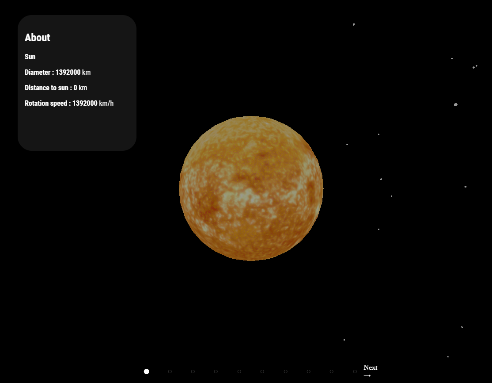

# Solar System 🌌

**Solar System** is an immersive application that allows you to explore the 3D solar system. Powered by Three.js, this application displays detailed 3D representations of planets in the solar system while providing fascinating information about each of them.

## Key Features

- 🪐 **3D Visualization**: Explore the solar system in 3D with accurate models of planets and their moons.

- 🌍 **Comprehensive Information**: Access details about each planet, including size, mass, distance from the sun, and more.

- 🖱️ **Intuitive Interaction**: Interact with the planets using your mouse or touchscreen to rotate and zoom.

- 📚 **Education and Entertainment**: Suitable for educational and entertainment purposes for astronomy enthusiasts.

## How to Use Solar System

1. **Clone the Repository**: `git clone https://github.com/your-username/SolarSystem.git`

2. **Install Dependencies**: `cd SolarSystem` and then `npm install`

3. **Run the Application**: `npm start` to explore the 3D solar system and obtain information about the planets.

